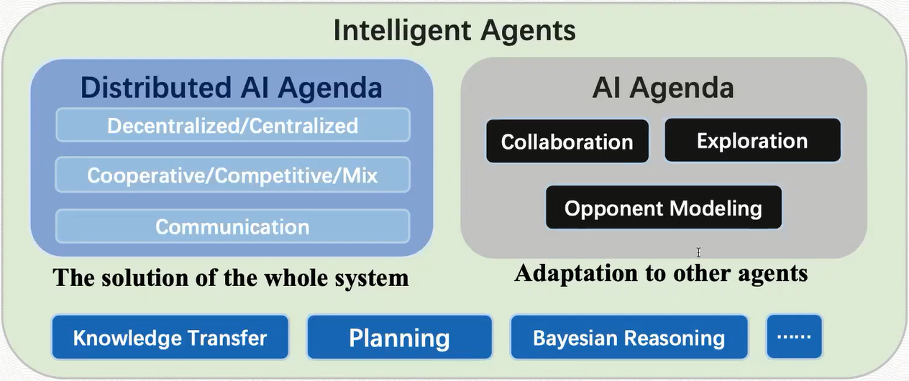

# Deep Multi-Agent Reinforcement Learning (MARL) Papers

## Centralized Training, Decentralized Execution (CTDE)

Value-Decomposition Networks For Cooperative Multi-Agent Learning
https://arxiv.org/abs/1706.05296

QMIX: Monotonic Value Function Factorisation for Deep Multi-Agent Reinforcement Learning
https://arxiv.org/abs/1803.11485

QTRAN: Learning to Factorize with Transformation for Cooperative Multi-Agent Reinforcement Learning
https://arxiv.org/abs/1905.05408

Multi-Agent Actor-Critic for Mixed Cooperative-Competitive Environments
https://papers.nips.cc/paper/7217-multi-agent-actor-critic-for-mixed-cooperative-competitive-environments

Counterfactual Multi-Agent Policy Gradients
https://arxiv.org/abs/1705.08926

Actor-Attention-Critic for Multi-Agent Reinforcement Learning
https://arxiv.org/abs/1810.02912

QPLEX: Duplex Dueling Multi-Agent Q-Learning
https://arxiv.org/abs/2008.01062

DOP: Off-Policy Multi-Agent Decomposed Policy Gradients
https://arxiv.org/abs/2007.12322v1

## Coordination

Hysteretic Q-learning : an algorithm for Decentralized Reinforcement Learning in Cooperative Multi-Agent Teams
https://ieeexplore.ieee.org/document/4399095

Deep Decentralized Multi-task Multi-Agent Reinforcement Learning under Partial Observability
https://arxiv.org/abs/1703.06182

Lenient Learning in Independent-Learner Stochastic Cooperative Games
https://jmlr.org/papers/v17/15-417.html

Lenient Multi-Agent Deep Reinforcement Learning
https://arxiv.org/abs/1707.04402

Explicitly Coordinated Policy Iteration
https://www.ijcai.org/Proceedings/2019/51

## Learning to Communicate

Learning to Communicate with Deep Multi-Agent Reinforcement Learning
https://arxiv.org/abs/1605.06676

Learning Multiagent Communication with Backpropagation
https://arxiv.org/abs/1605.07736

Multiagent Bidirectionally-Coordinated Nets: Emergence of Human-level Coordination in Learning to Play StarCraft Combat Games
https://arxiv.org/abs/1703.10069

ACCNet: Actor-Coordinator-Critic Net for "Learning-to-Communicate" with Deep Multi-agent Reinforcement Learning
https://arxiv.org/abs/1706.03235

Learning Attentional Communication for Multi-Agent Cooperation
https://arxiv.org/abs/1805.07733

Learning when to Communicate at Scale in Multiagent Cooperative and Competitive Tasks
https://arxiv.org/abs/1812.09755

TarMAC: Targeted Multi-Agent Communication
https://arxiv.org/abs/1810.11187

Learning Nearly Decomposable Value Functions Via Communication Minimization
https://arxiv.org/abs/1910.05366

Learning to Schedule Communication in Multi-agent Reinforcement Learning
https://arxiv.org/abs/1902.01554

Social Influence as Intrinsic Motivation for Multi-Agent Deep Reinforcement Learning
https://arxiv.org/abs/1810.08647

InfoBot: Transfer and Exploration via the Information Bottleneck
https://arxiv.org/abs/1901.10902

## Neural Network Design

Deep reinforcement learning with relational inductive biases
https://openreview.net/forum?id=HkxaFoC9KQ

Action Semantics Network: Considering the Effects of Actions in Multiagent Systems
https://arxiv.org/abs/1907.11461

Multi-Agent Game Abstraction via Graph Attention Neural Network
https://arxiv.org/abs/1911.10715

From Few to More: Large-scale Dynamic Multiagent Curriculum Learning
https://arxiv.org/abs/1909.02790

## Opponent Exploration

Opponent Modeling in Deep Reinforcement Learning
https://arxiv.org/abs/1609.05559

Efficiently detecting switches against non-stationary opponents
http://ifaamas.org/Proceedings/aamas2017/pdfs/p920.pdf

An exploration strategy for non-stationary opponents
https://link.springer.com/article/10.1007/s10458-016-9347-3?shared-article-renderer

A Deep Bayesian Policy Reuse Approach Against Non-Stationary Agents
https://papers.nips.cc/paper/7374-a-deep-bayesian-policy-reuse-approach-against-non-stationary-agents

Autonomous Agents Modelling Other Agents: A Comprehensive Survey and Open Problems
https://arxiv.org/abs/1709.08071

A Deep Policy Inference Q-Network for Multi-Agent Systems
https://arxiv.org/abs/1712.07893

Learning with Opponent-Learning Awareness
https://arxiv.org/abs/1709.04326

Bayes-ToMoP: A Fast Detection and Best Response Algorithm Towards Sophisticated Opponents
http://www.ifaamas.org/Proceedings/aamas2019/pdfs/p2282.pdf

Towards Efficient Detection and Optimal Response against Sophisticated Opponents
https://arxiv.org/abs/1809.04240

## Multi-Agent Exploration

Influence-Based Multi-Agent Exploration
https://arxiv.org/abs/1910.05512

Coordinated Exploration in Concurrent Reinforcement Learning
https://arxiv.org/abs/1802.01282

Scalable Coordinated Exploration in Concurrent Reinforcement Learning
https://arxiv.org/abs/1805.08948

Learning to Coordinate with Coordination Graphs in Repeated Single-Stage Multi-Agent Decision Problems
http://proceedings.mlr.press/v80/bargiacchi18a.html

Coordinated Exploration via Intrinsic Rewards for Multi-Agent Reinforcement Learning
https://arxiv.org/abs/1905.12127

